<div align="center">

# DeenBG

### Automated Quran Wallpaper Generator for Windows

A Windows automation tool that sets a random Quranic verse as your wallpaper on every login, serving as a gentle reminder to stay connected to the Quran.


</div>

---

## What is DeenBG?

**DeenBG** is a lightweight Windows automation tool that sets a random Quran ayah as your desktop wallpaper each time you log in. It beautifully renders the Arabic text (with proper diacritics), a clear English translation, and the surah reference. All in a clean, readable layout that adapts to your screen resolution.

More than just a wallpaper changer, DeenBG turns your everyday screen time into a moment of reflection. Without interrupting your workflow, it gently reminds you of the Quran throughout the day, helping you stay connected to your deen, improve familiarity with ayahs, and build a consistent habit of remembrance effortlessly.

---

## Available Themes

|                                                   |                                           |
| ------------------------------------------------- | ----------------------------------------- |
| **Midnight Blue**                                 | **Obsidian**                              |
| 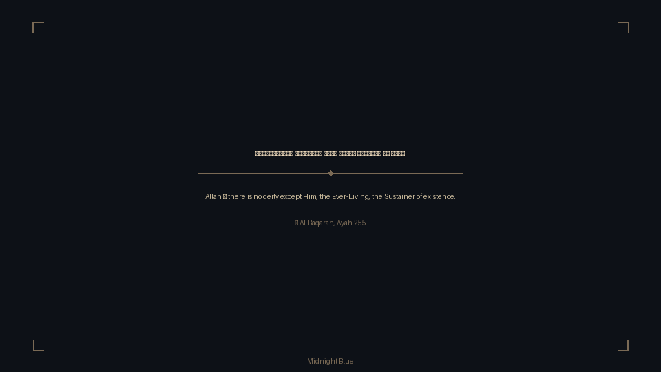 | 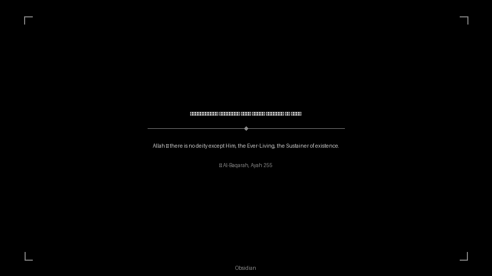   |
| **Charcoal & Gold**                               | **Parchment**                             |
| 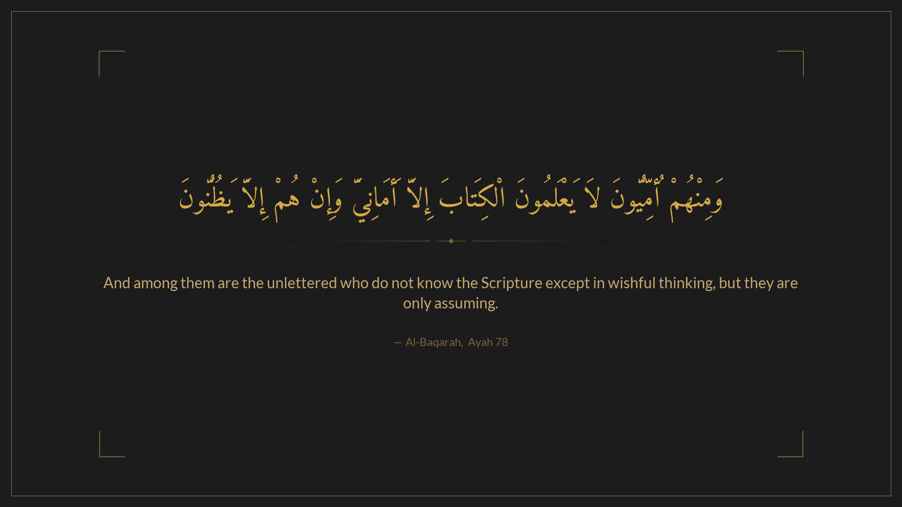 | 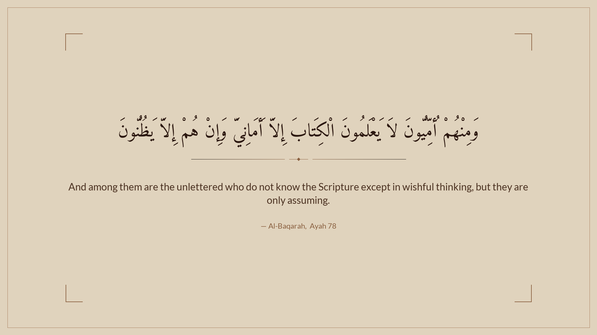 |
| **Slate**                                         | **Forest**                                |
| 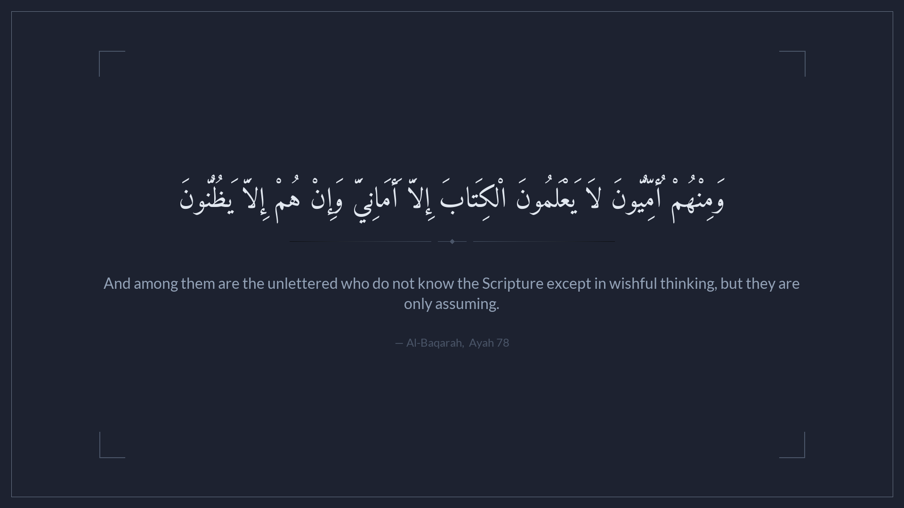                 | 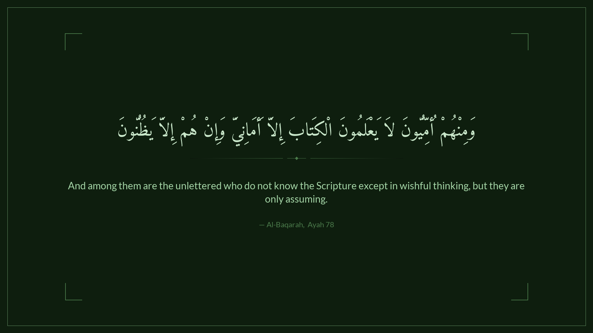       |
| **Desert Sand**                                   | **Ivory Minimal**                         |
| 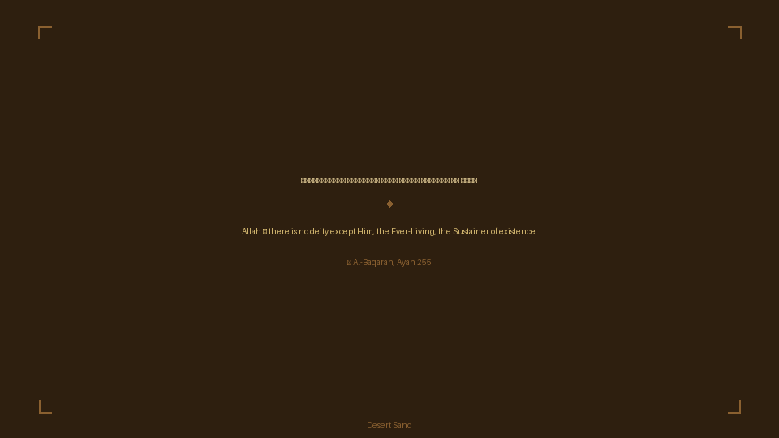               | 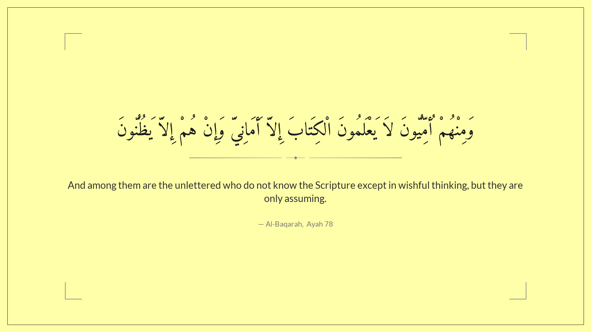         |
| **Deep Teal**                                     | **Rose Noir**                             |
| 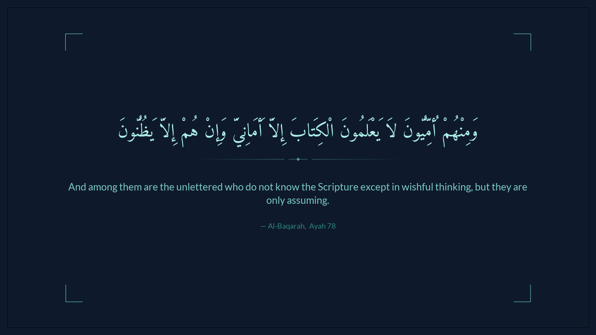         | 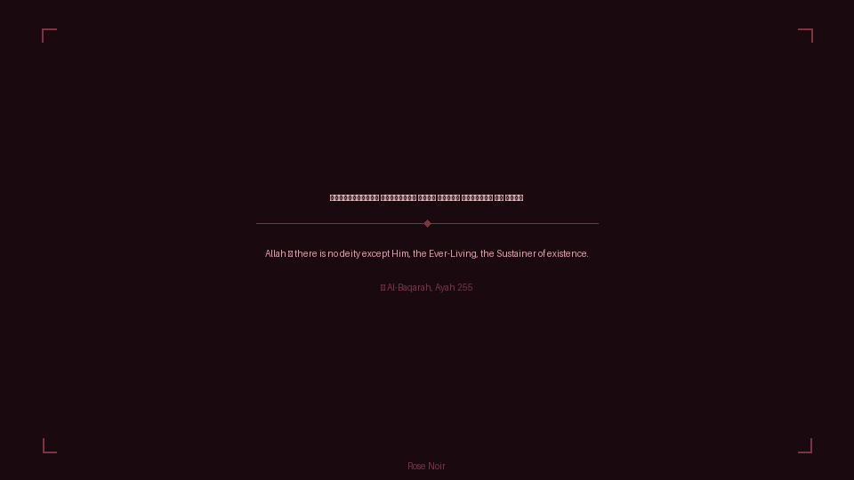 |

---

## Preview

|                                              |                                         |
| -------------------------------------------- | --------------------------------------- |
| 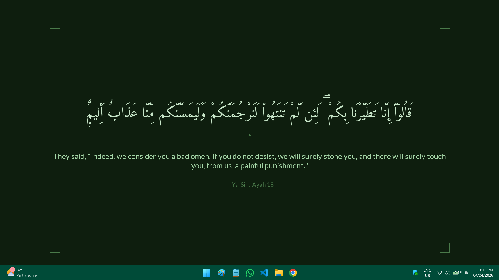 | 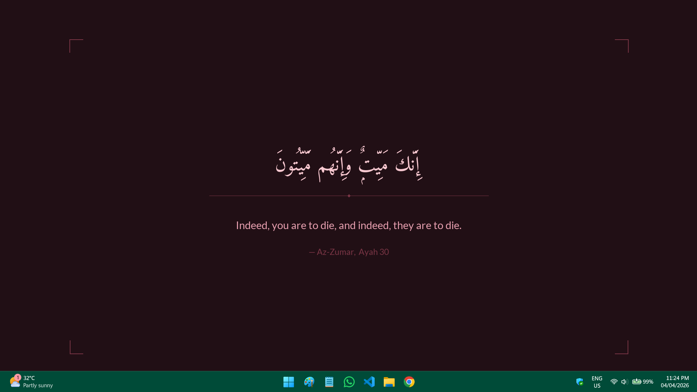 |

## Features

- **Full Arabic harakah** — tashkeel is preserved and rendered correctly using Amiri font
- **10 built-in themes** — from elegant dark themes to warm manuscript-inspired looks
- **Fully offline** — Quran data is downloaded once, then works without internet forever
- **Auto screen resolution** — font sizes and layout scale to any resolution (1080p, 1440p, 4K)
- **No repeat ayahs** — caches seen ayahs, cycles through all 6,236 before repeating
- **Task Scheduler integration** — runs silently at every login, no console window
- **Configurable** — change theme, translation, or any setting in `config.json`

---

## Quick Start

### Requirements

- Windows 10 or 11
- Python 3.10+ — [download here](https://www.python.org/downloads/)
  - ✅ Check **"Add Python to PATH"** during installation

### Install

```
1. Unzip DeenBG to a permanent folder, e.g.:  C:\Users\You\DeenBG\
3. Run install.bat
4. Follow the prompts
```

The installer will:

1. Install Python dependencies
2. Download the Quran database (one-time, ~3 MB)
3. Walk you through theme and translation selection
4. Register with Windows Task Scheduler
5. Generate your first wallpaper immediately

---

## Configuration

Settings are stored in `config.json`. Edit it anytime — changes take effect on next run.

```json
{
  "design": {
    "theme": "midnight_blue",
    "font_arabic": "Amiri-Regular.ttf",
    "font_latin": "Lato-Regular.ttf",
    "decorative_line": true
  },
  "behavior": {
    "avoid_repeats": true,
    "max_cache_size": 6236,
    "save_wallpapers": true,
    "max_saved_wallpapers": 30
  }
}
```

<!--
### Available Themes

| Key             | Name            | Style                        |
| --------------- | --------------- | ---------------------------- |
| `midnight_blue` | Midnight Blue   | Dark navy, warm cream text   |
| `obsidian`      | Obsidian        | Pure black, white text       |
| `charcoal_gold` | Charcoal & Gold | Dark charcoal, golden Arabic |
| `parchment`     | Parchment       | Warm beige, dark ink         |
| `slate`         | Slate           | Blue-grey, soft white        |
| `forest`        | Forest          | Deep green, mint text        |
| `desert`        | Desert Sand     | Warm brown, golden text      |
| `ivory`         | Ivory Minimal   | Off-white, dark text         |
| `deep_teal`     | Deep Teal       | Dark teal, soft cyan         |
| `rose_noir`     | Rose Noir       | Dark maroon, rose text       |
-->

### Translation Options

Set `api.translation_edition` in `config.json`, then re-run `fetch_quran_data.py --force`:

| Value          | Translation                        |
| -------------- | ---------------------------------- |
| `en.sahih`     | Saheeh International (recommended) |
| `en.pickthall` | Pickthall                          |
| `en.yusufali`  | Yusuf Ali                          |
| `en.asad`      | Muhammad Asad                      |

---

## Project Structure

```
DeenBG/
├── wallpaper_generator.py   ← Main script (runs at login)
├── fetch_quran_data.py      ← One-time data downloader
├── setup_wizard.py          ← Interactive configuration
├── install_task.py          ← Task Scheduler registration
├── install.bat              ← One-click installer
├── requirements.txt
├── config.json              ← Your settings (auto-created)
├── fonts/
│   ├── Amiri-Regular.ttf    ← Place here manually
│   └── Lato-Regular.ttf     ← Place here manually
├── data/
│   └── quran.json           ← Offline Quran DB (auto-created)
├── wallpapers/              ← Generated PNGs (auto-pruned)
├── cache/
│   └── seen_ayahs.json      ← Repeat-avoidance cache
├── logs/
│   └── deenbg.log
└── docs/
    └── previews/            ← Theme preview images
```

---

## Troubleshooting

**Wallpaper doesn't change at login**
Open `logs/deenbg.log` — it will tell you exactly what went wrong.

**Arabic shows boxes instead of text**
`Amiri-Regular.ttf` is missing from the `fonts/` folder. Place it there and run again.

**"Quran database not found" error**
Run `python fetch_quran_data.py` — it downloads the data file.

**Task Scheduler shows error code 0x1**
Open Task Scheduler (`taskschd.msc`), right-click DeenBG → Run, then check the log file.

**Want to change theme**
Edit `config.json`, change `"theme"` to any key from the themes table above.

---

## Font Credits

- **Amiri** — by Dr. Khaled Hosny, SIL Open Font License — [amirifont.org](https://www.amirifont.org)
- **Lato** — by Łukasz Dziedzic, SIL Open Font License — [Google Fonts](https://fonts.google.com/specimen/Lato)

Quran text and translations sourced from [AlQuran.cloud](https://alquran.cloud) (downloaded once, stored locally).

---

## License

MIT — free to use, share, and modify.

---
